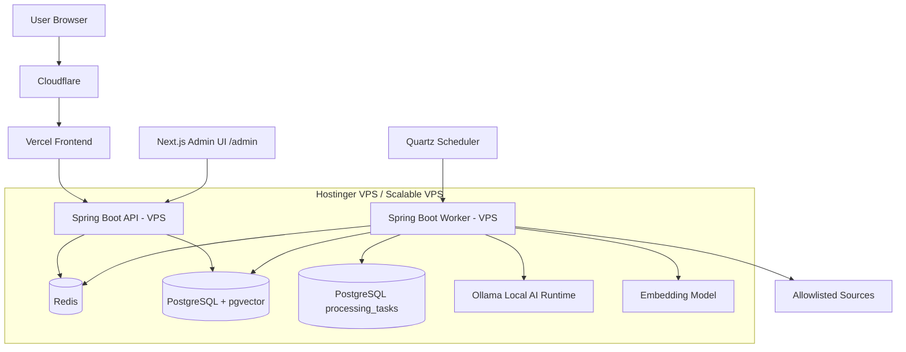
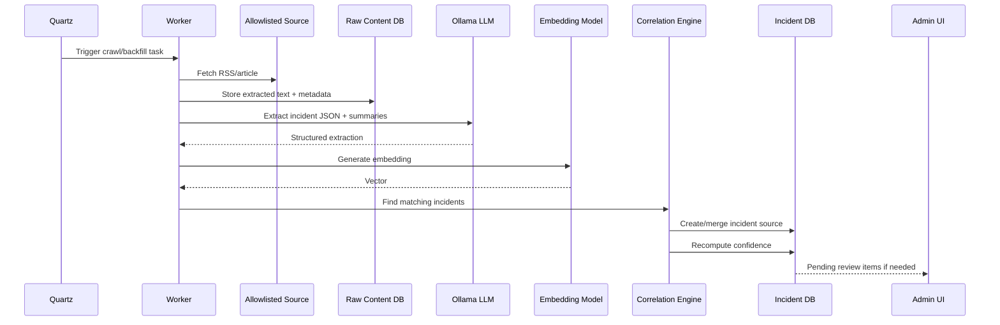
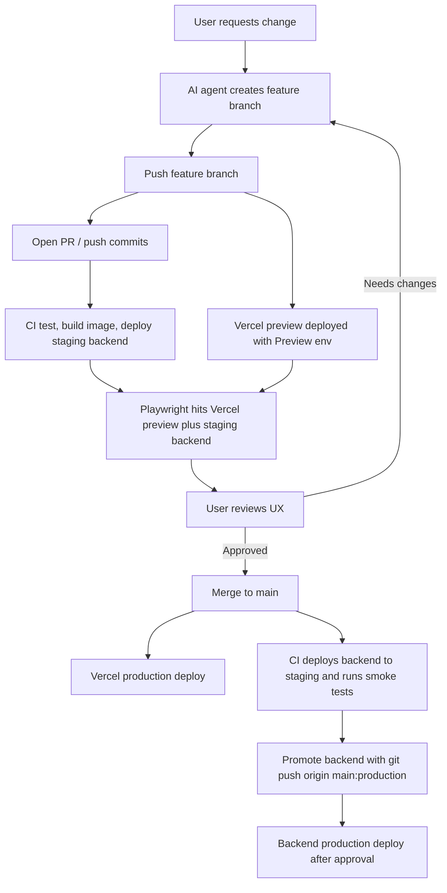

# Political Incident Monitoring Platform — Technical Design Document

**Document purpose:** Agent-ready technical design for building the MVP.

**Primary goal:** Build a public, evidence-first political accountability platform that tracks source-corroborated incidents involving the Government and Opposition in Bangladesh from the accepted accountability start date.

---

## 1. Executive Summary

The platform aggregates publicly available reports from allowlisted news and official sources, extracts candidate political accountability incidents, clusters duplicate reports, computes a corroboration confidence score, and presents published incidents in a bilingual public feed.

The system must not behave like a social media product or an AI truth engine. It should behave like a structured civic incident intelligence platform.

Core principle:

> AI assists extraction, summarization, translation, and deduplication. It does not determine legal truth, guilt, or final verification.

---

## 2. Product Scope

### 2.1 MVP Includes

- Public Government/Opposition feed.
- Government feed is default.
- Bangla/English language toggle in the top navigation.
- Category filters on the left side, all selected by default.
- Feed cards with title, summary, confidence gauge, actor color, source chips, date, and location where available.
- Public incident detail page.
- Methodology/legal page in Bangla and English.
- AI-assisted ingestion from allowlisted newspapers and official sources.
- Source clustering/deduplication.
- Confidence score based on corroboration.
- Auto-publish only high-confidence incidents.
- Minimal internal admin UI for pending review.
- Staging and production environments with deployment parity.
- CI/CD feedback loop for AI-assisted development.

### 2.2 Explicitly Excluded from MVP

- Public user accounts.
- Login/registration for public users.
- Thumbs up/down reactions.
- Comments.
- Popularity-based ranking.
- Public or admin search.
- Facebook, YouTube, blogs, unknown sites, screenshot-only ingestion.
- Source credibility weighting.
- Coalition/party drilldown.
- Combined “All” feed.
- Bangladesh map visualization.
- Correction/removal request workflow.
- OpenSearch.
- Kafka/RabbitMQ/Temporal/Kubernetes.

---

## 3. Political Context Configuration

```yaml
politicalContext:
  electionDate: "2026-02-12"
  accountabilityStartDate: "2026-02-17"
  defaultActorRole: GOVERNMENT
```

The platform starts tracking from **17 February 2026**, the accepted start of the governing regime/premiership.

---

## 4. Actor Model

The public product model is role-based, not party-name-based.

```yaml
actorRoles:
  - GOVERNMENT
  - OPPOSITION
  - UNKNOWN

publishedActorRoles:
  - GOVERNMENT
  - OPPOSITION

actorMappings:
  GOVERNMENT:
    displayName:
      en: Government
      bn: সরকার
    currentMapping:
      party: BNP / Bangladesh Nationalist Party
      from: "2026-02-17"
    color: blue

  OPPOSITION:
    displayName:
      en: Opposition
      bn: বিরোধী দল
    currentMapping:
      coalition: Jamaat-led 11 Party Alliance
      from: "2026-02-17"
    color: red
```

If an incident cannot be confidently mapped to Government or Opposition, it is stored internally as `UNKNOWN` and excluded from the public feed.

No party or coalition drilldown is required in MVP.

---

## 5. Incident Inclusion Rule

An incident is included only if it has a political accountability link.

Accepted political accountability links include:

- Party member.
- Party wing.
- Elected official.
- Government institution.
- Police or administration abuse.
- Politically motivated violence.
- Source-reported political patronage.

The platform must not become a general crime tracker.

---

## 6. Incident Categories

Backend supports this taxonomy:

```yaml
categories:
  - code: POLITICAL_VIOLENCE
    label:
      en: Political Violence
      bn: রাজনৈতিক সহিংসতা

  - code: KILLING
    label:
      en: Killing / Murder
      bn: হত্যা / খুন

  - code: MOB_VIOLENCE
    label:
      en: Mob Violence / Lynching
      bn: গণপিটুনি / জনতার সহিংসতা

  - code: SEXUAL_VIOLENCE
    label:
      en: Sexual Violence
      bn: যৌন সহিংসতা

  - code: CORRUPTION_BRIBERY
    label:
      en: Corruption / Bribery
      bn: দুর্নীতি / ঘুষ

  - code: EXTORTION
    label:
      en: Extortion / Chanda
      bn: চাঁদাবাজি

  - code: LAND_GRABBING
    label:
      en: Land Grabbing / Property Capture
      bn: জমি দখল / সম্পত্তি দখল

  - code: ARMED_THREAT_ATTACK
    label:
      en: Armed Threat / Attack
      bn: সশস্ত্র হুমকি / হামলা

  - code: ABDUCTION_CONFINEMENT
    label:
      en: Abduction / Confinement
      bn: অপহরণ / আটক

  - code: ROBBERY_MUGGING
    label:
      en: Robbery / Mugging
      bn: ডাকাতি / ছিনতাই

  - code: INTIMIDATION
    label:
      en: Threat / Intimidation
      bn: হুমকি / ভয়ভীতি

  - code: ABUSE_OF_POWER
    label:
      en: Abuse of Power
      bn: ক্ষমতার অপব্যবহার

  - code: ATTACK_ON_INSTITUTION
    label:
      en: Attack on Institution
      bn: প্রতিষ্ঠানে হামলা

  - code: COMMUNAL_RELIGIOUS_VIOLENCE
    label:
      en: Communal / Religious Violence
      bn: সাম্প্রদায়িক / ধর্মীয় সহিংসতা

  - code: DRUG_ARMS_CRIME
    label:
      en: Drug / Illegal Arms Nexus
      bn: মাদক / অবৈধ অস্ত্র সংশ্লিষ্ট অপরাধ

  - code: ELECTION_VIOLENCE
    label:
      en: Election Violence / Obstruction
      bn: নির্বাচন সহিংসতা / বাধা
```

MVP visible default filters:

```yaml
visibleDefaultCategories:
  - POLITICAL_VIOLENCE
  - KILLING
  - MOB_VIOLENCE
  - SEXUAL_VIOLENCE
  - CORRUPTION_BRIBERY
  - EXTORTION
  - LAND_GRABBING
  - ARMED_THREAT_ATTACK
  - ABDUCTION_CONFINEMENT
  - INTIMIDATION
  - ABUSE_OF_POWER
  - ATTACK_ON_INSTITUTION
  - COMMUNAL_RELIGIOUS_VIOLENCE
```

Secondary supported categories:

```yaml
secondaryCategories:
  - ROBBERY_MUGGING
  - DRUG_ARMS_CRIME
  - ELECTION_VIOLENCE
```

---

## 7. User Experience Requirements

### 7.1 Public Header

Header includes:

- Government/Opposition selector.
- Bangla/English toggle.
- Link to methodology/legal page.

Default feed: `GOVERNMENT`.

### 7.2 Language Toggle

```yaml
uiLanguages:
  default: bn
  supported:
    - bn
    - en
```

Recommended routing:

```text
/bn?actorRole=GOVERNMENT
/en?actorRole=OPPOSITION
```

URL state includes:

```yaml
urlState:
  include:
    - actorRole
    - language
  exclude:
    - categories
```

Category filter state is local frontend state only.

### 7.3 Feed Filters

```yaml
filters:
  actorRole:
    - GOVERNMENT
    - OPPOSITION

  categories:
    multiSelect: true
    default: all_selected

  sort:
    - RECOMMENDED
    - NEWEST
    - MOST_CORROBORATED
```

Excluded filters for MVP:

- District.
- Date range.
- Confidence threshold.
- Source publisher.

### 7.4 Feed Ranking

Default ranking combines recency and confidence only.

```text
feedScore = recencyScore * 0.50 + confidenceScore * 0.50
```

Popularity/clicks/detail visits do not affect ranking in MVP.

### 7.5 Pagination and Infinite Scroll

Backend uses page-number pagination.

Frontend uses infinite scroll behavior: when the user scrolls near the bottom, it requests the next page and appends results.

```yaml
pagination:
  type: PAGE_NUMBER
  defaultPageSize: 20
  maxPageSize: 50
  ui: infinite_scroll_using_page_numbers
```

### 7.6 Feed Card Source Display

```yaml
feedCardSources:
  visibleSources: 3
  overflowLabel: "+{n} more"
  sourceClickBehavior: direct_open_new_tab
  moreClickBehavior: open_incident_detail_page
```

Source links open directly in a new tab.

```yaml
sourceLinks:
  behavior: direct_open_new_tab
  rel:
    - noopener
    - noreferrer
  trackingRedirect: false
```

### 7.7 Confidence UI

Public confidence is displayed as a numeric 0–100 half-speedometer gauge.

```yaml
confidenceUi:
  displayType: half_speedometer_gauge
  numericRange: 0_to_100
  showNumericScore: true
  showExplanation: true
```

Bands:

```yaml
confidenceBands:
  - range: 0-39
    label: Low Corroboration
  - range: 40-69
    label: Moderate Corroboration
  - range: 70-100
    label: Highly Corroborated
```

The score represents corroboration strength, not legal truth, guilt, or court-verified fact.

### 7.8 Incident Detail Page

MVP includes public detail pages.

Fields:

```yaml
incidentDetail:
  - title
  - localized summary
  - confidence score
  - confidence explanation
  - all source links
  - source publication dates
  - extracted location
  - incident date
  - categories
  - actor role
  - disclaimer note
```

---

## 8. Source Inclusion Policy

Allowed source types:

```yaml
allowedSourceTypes:
  - NEWSPAPER
  - OFFICIAL_GOVERNMENT
  - OFFICIAL_POLICE
  - COURT_OR_LEGAL
```

Excluded source types:

```yaml
excludedSourceTypes:
  - FACEBOOK_PAGE
  - YOUTUBE_CHANNEL
  - PERSONAL_BLOG
  - UNKNOWN_WEBSITE
  - SCREENSHOT_ONLY_SOURCE
```

Initial newspaper allowlist:

```yaml
newspaperAllowlist:
  - Prothom Alo
  - The Daily Star
  - bdnews24
  - Dhaka Tribune
  - New Age
  - The Business Standard
  - Jugantor
  - Kaler Kantho
  - Samakal
  - Ittefaq
```

All allowlisted sources count equally in MVP confidence scoring.

```yaml
sourceCredibility:
  enabled: false
  allAllowlistedSourcesEqual: true
```

---

## 9. System Architecture

### 9.1 High-Level Architecture



### 9.2 Backend Runtime Split

Same codebase, separate runtime processes:

```yaml
processes:
  api:
    role: public_api_and_admin_api
  worker:
    role: ingestion_ai_deduplication_jobs
  sameCodebase: true
  springProfiles:
    - api
    - worker
```

The API process must not execute long-running crawler or AI jobs.

### 9.3 Repository Structure

```text
incident-monitor/
  frontend/
  backend/
  infra/
  docs/
```

---

## 10. Technology Stack

### 10.1 Frontend

- Next.js.
- React.
- TypeScript.
- TailwindCSS.
- shadcn/ui.
- TanStack Query.
- Vercel for preview and production frontend deployments.

### 10.2 Backend

- Java 25.
- Spring Boot 3.
- Spring Security.
- Spring AI integration where useful.
- Quartz Scheduler.
- Flyway.

### 10.3 Data

- PostgreSQL.
- pgvector.
- Redis.
- Flyway versioned SQL migrations.

```yaml
databaseMigrations:
  tool: Flyway
  migrationStyle: versioned_sql
  staging: auto_run_on_deploy
  production: approval_gated
  rollbackPolicy: forward_fix
```

### 10.4 AI

```yaml
aiRuntime:
  primary: Ollama
  fallback: disabled_by_default
  fallbackProvider: configurable
```

LLM model selection:

```yaml
llmModelSelection:
  initialCandidate: qwen-8b-class
  benchmarkRequired: true
  benchmarkDatasetSize: 100
  benchmarkLanguages:
    - bn
    - en
  benchmarkTasks:
    - incident_detection
    - actor_extraction
    - category_classification
    - location_extraction
    - summary_bn
    - summary_en
```

Embedding model selection:

```yaml
embeddingModelSelection:
  initialCandidate: bge-m3
  benchmarkRequired: true
  compareWith:
    - multilingual-e5-large
  benchmarkTasks:
    - same_incident_similarity
    - different_incident_separation
    - cross_lingual_bn_en_matching
```

---

## 11. Ingestion and Processing

### 11.1 Ingestion Strategy

```yaml
ingestionStrategy:
  primary: RSS
  fallback: DIRECT_SCRAPE
  perPublisherConfig: true
```

### 11.2 Raw Content Storage

```yaml
rawContentStorage:
  extractedText: PostgreSQL
  relevantExcerpt: PostgreSQL
  rawHtml: not_in_mvp
  publicFullTextDisplay: false
```

Public UI must not republish full article text.

### 11.3 Crawler Deduplication

```yaml
crawlerDeduplication:
  canonicalUrl: true
  removeTrackingParams: true
  contentHash: true
  uniqueConstraints:
    - publisher_id + canonical_url
    - content_hash
```

### 11.4 Scheduled Ingestion

Daily ingestion:

```yaml
dailyIngestion:
  schedule: "02:00 Asia/Dhaka"
  window: rolling_3_days
  dedupeExistingRawContent: true
  dedupeExistingIncidents: true
```

Backfill:

```yaml
backfill:
  startDate: "2026-02-17"
  batchUnit: DAY
  schedule: hourly
  daysPerRun: 1
  resumable: true
  checkpointTable: ingestion_job_runs
  retryFailedDays: true
  stopCondition: reaches_current_rolling_window
  afterCatchup: idle
  canResumeIfStartDateChanges: true
  canReprocessFailedDays: true
```

### 11.5 Processing Pipeline



### 11.6 PostgreSQL Task Queue

```yaml
taskQueue:
  type: PostgreSQL
  table: processing_tasks
  workers: backend-worker
  retryable: true
  deadLetterStatus: FAILED_PERMANENTLY
```

Task types:

```yaml
taskTypes:
  - CRAWL_SOURCE_DAY
  - EXTRACT_INCIDENT
  - GENERATE_EMBEDDING
  - CORRELATE_INCIDENT
  - GENERATE_TRANSLATIONS
  - RECOMPUTE_CONFIDENCE
```

Failure policy:

```yaml
taskFailurePolicy:
  maxAttempts: 5
  backoff:
    type: exponential
    initialDelayMinutes: 5
    maxDelayHours: 6
  finalStatus: FAILED_PERMANENTLY
  adminCanRetry: true
```

---

## 12. AI Responsibilities and Boundaries

### 12.1 AI May Do

- Incident detection.
- Actor extraction.
- Category classification.
- Location extraction.
- Entity extraction.
- Bangla summary generation.
- English summary generation.
- Embedding generation for deduplication.
- Similarity assistance.

### 12.2 AI Must Not Do

- Decide legal guilt.
- Publish single-source weak allegations.
- Infer actor role from weak context.
- Replace source evidence.
- Create unsourced claims.

---

## 13. Deduplication and Confidence

### 13.1 Deduplication

Two-phase strategy:

1. Cheap candidate narrowing:
   - Date proximity.
   - District/location.
   - Actor role.
   - Category overlap.
   - Entity overlap.

2. Semantic matching:
   - Embedding cosine similarity.
   - Title similarity.
   - Normalized entity overlap.
   - Date proximity.
   - District match.
   - Category overlap.

Thresholds:

```yaml
dedupePolicy:
  autoMergeThreshold: 0.86
  manualReviewThreshold: 0.72
  belowManualReviewThreshold: create_new_incident
```

```text
similarity >= 0.86
  -> automatically attach source to existing incident

0.72 <= similarity < 0.86
  -> possible duplicate; send to pending review

similarity < 0.72
  -> create new incident
```

### 13.2 Confidence Formula

```text
confidenceScore =
  sourceCountScore * 0.45
  + independentPublisherScore * 0.35
  + metadataConsistencyScore * 0.20
```

Source count score:

```yaml
sourceCountScore:
  1 source: 20
  2 sources: 45
  3 sources: 60
  5 sources: 80
  8+ sources: 100
```

Independent publisher score:

```yaml
independentPublisherScore:
  1 publisher: 20
  2 publishers: 55
  3 publishers: 75
  5+ publishers: 100
```

Metadata consistency score:

```yaml
metadataConsistencyScore:
  date_location_category_entities_agree_strongly: 100
  mostly_consistent: 70
  partially_consistent: 40
  conflicting: 10
```

### 13.3 Publishing Criteria

Auto-publish only if:

```yaml
autoPublishCriteria:
  minSourceCount: 2
  minIndependentPublisherCount: 2
  minExtractionConfidence: 0.75
  politicalAccountabilityLinkRequired: true
  actorRoleMustNotBeUnknown: true
```

Otherwise, incident remains `PENDING_REVIEW`.

---

## 14. Incident Lifecycle

```yaml
incidentStatuses:
  - RAW_CAPTURED
  - AI_EXTRACTED
  - PENDING_REVIEW
  - AUTO_PUBLISHED
  - MANUALLY_PUBLISHED
  - REJECTED
  - ARCHIVED
```

Meanings:

- `RAW_CAPTURED`: source fetched but not processed.
- `AI_EXTRACTED`: AI found a candidate incident.
- `PENDING_REVIEW`: not enough confidence to publish automatically.
- `AUTO_PUBLISHED`: meets auto-publish criteria.
- `MANUALLY_PUBLISHED`: human approved.
- `REJECTED`: irrelevant, incorrect, unsafe, or outside scope.
- `ARCHIVED`: removed from active feed but retained for audit/history.

---

## 15. Data Model

### 15.1 Core Tables

```sql
create table incidents (
  id uuid primary key,
  actor_role text not null,
  incident_date date,
  location_id uuid,
  extracted_location_text text,
  confidence_score numeric(5,2),
  confidence_level text,
  status text not null,
  source_count integer not null default 0,
  independent_publisher_count integer not null default 0,
  created_at timestamptz not null,
  updated_at timestamptz not null
);

create table incident_translations (
  incident_id uuid references incidents(id),
  language_code text not null,
  title text not null,
  summary text not null,
  primary key (incident_id, language_code)
);

create table publishers (
  id uuid primary key,
  name text not null,
  type text not null,
  domain text,
  homepage_url text,
  logo_url text,
  active boolean not null default true,
  created_at timestamptz not null,
  updated_at timestamptz not null
);

create table incident_sources (
  id uuid primary key,
  incident_id uuid references incidents(id),
  publisher_id uuid references publishers(id),
  source_url text not null,
  canonical_url text not null,
  source_title text,
  relevant_excerpt text,
  published_at timestamptz,
  fetched_at timestamptz not null,
  source_type text not null,
  ai_relevance_score numeric(5,2),
  created_at timestamptz not null
);

create table raw_contents (
  id uuid primary key,
  publisher_id uuid references publishers(id),
  source_url text not null,
  canonical_url text not null,
  source_title text,
  extracted_text text,
  relevant_excerpt text,
  content_hash text not null,
  language_code text,
  fetched_at timestamptz not null,
  parsing_status text not null,
  ai_processing_status text not null,
  unique (publisher_id, canonical_url),
  unique (content_hash)
);
```

### 15.2 Location Tables

```sql
create table locations (
  id uuid primary key,
  country text not null default 'Bangladesh',
  division text,
  district text,
  upazila text,
  union_or_area text,
  latitude numeric,
  longitude numeric
);
```

MVP must normalize to at least district level whenever possible.

Future map requirement:

- Bangladesh map.
- District-level aggregation.
- Government incidents blue.
- Opposition incidents red.
- Not in MVP.

### 15.3 Processing Tables

```sql
create table processing_tasks (
  id uuid primary key,
  task_type text not null,
  payload jsonb not null,
  status text not null,
  attempt_count integer not null default 0,
  max_attempts integer not null default 5,
  available_at timestamptz not null,
  locked_at timestamptz,
  locked_by text,
  last_error text,
  created_at timestamptz not null,
  updated_at timestamptz not null
);

create table ingestion_job_runs (
  id uuid primary key,
  job_type text not null,
  target_date date,
  status text not null,
  started_at timestamptz,
  finished_at timestamptz,
  error_message text,
  created_at timestamptz not null
);
```

---

## 16. API Design

No full OpenAPI spec is required in the design doc. Use these examples as implementation contracts.

### 16.1 Public Feed API

```http
GET /api/incidents?actorRole=GOVERNMENT&language=bn&sort=RECOMMENDED&page=1&pageSize=20
```

Response:

```json
{
  "items": [
    {
      "id": "9d5b0df1-6f14-4a5d-bc6f-83460f7b1f73",
      "actorRole": "GOVERNMENT",
      "actorColor": "blue",
      "title": "স্থানীয় নেতার বিরুদ্ধে চাঁদাবাজির অভিযোগ",
      "summary": "একাধিক সংবাদমাধ্যমে স্থানীয় রাজনৈতিক সংশ্লিষ্ট ব্যক্তির বিরুদ্ধে ব্যবসায়ীদের কাছ থেকে অর্থ দাবির অভিযোগ প্রকাশিত হয়েছে।",
      "categories": ["EXTORTION", "ABUSE_OF_POWER"],
      "incidentDate": "2026-03-04",
      "location": {
        "district": "Dhaka",
        "division": "Dhaka",
        "displayText": "Mirpur, Dhaka"
      },
      "confidence": {
        "score": 82,
        "label": "Highly Corroborated",
        "explanation": "Reported by 5 sources from 4 independent publishers."
      },
      "sourcesPreview": [
        {
          "publisherName": "Prothom Alo",
          "url": "https://example.com/source-1"
        },
        {
          "publisherName": "The Daily Star",
          "url": "https://example.com/source-2"
        },
        {
          "publisherName": "bdnews24",
          "url": "https://example.com/source-3"
        }
      ],
      "remainingSourceCount": 2,
      "detailUrl": "/bn/incidents/9d5b0df1-6f14-4a5d-bc6f-83460f7b1f73"
    }
  ],
  "page": 1,
  "pageSize": 20,
  "totalPages": 12,
  "totalItems": 234
}
```

### 16.2 Incident Detail API

```http
GET /api/incidents/9d5b0df1-6f14-4a5d-bc6f-83460f7b1f73?language=en
```

Response:

```json
{
  "id": "9d5b0df1-6f14-4a5d-bc6f-83460f7b1f73",
  "actorRole": "GOVERNMENT",
  "actorColor": "blue",
  "title": "Local leader accused of extortion",
  "summary": "Multiple news outlets reported allegations that a politically affiliated local leader demanded payments from business owners.",
  "categories": ["EXTORTION", "ABUSE_OF_POWER"],
  "incidentDate": "2026-03-04",
  "location": {
    "country": "Bangladesh",
    "division": "Dhaka",
    "district": "Dhaka",
    "upazila": null,
    "displayText": "Mirpur, Dhaka"
  },
  "confidence": {
    "score": 82,
    "label": "Highly Corroborated",
    "explanation": "Reported by 5 sources from 4 independent publishers. Metadata was mostly consistent across reports."
  },
  "sources": [
    {
      "publisherName": "Prothom Alo",
      "sourceTitle": "Example source title",
      "url": "https://example.com/source-1",
      "publishedAt": "2026-03-04T09:00:00Z"
    }
  ],
  "disclaimer": "Confidence scores represent source corroboration strength, not legal proof, guilt, or a court finding."
}
```

### 16.3 Categories API

```http
GET /api/categories?language=bn
```

Response:

```json
{
  "items": [
    {
      "code": "EXTORTION",
      "label": "চাঁদাবাজি",
      "defaultVisible": true
    },
    {
      "code": "KILLING",
      "label": "হত্যা / খুন",
      "defaultVisible": true
    }
  ]
}
```

### 16.4 Admin Pending Incidents API

```http
GET /internal/admin/incidents/pending?page=1&pageSize=20
Authorization: Basic ...
```

Response:

```json
{
  "items": [
    {
      "id": "b7c2a3b8-80db-4e94-a7be-f3e55d4bc2de",
      "status": "PENDING_REVIEW",
      "actorRole": "UNKNOWN",
      "candidateTitle": "AI extracted candidate title",
      "candidateSummary": "AI extracted candidate summary",
      "sourceCount": 1,
      "independentPublisherCount": 1,
      "extractionConfidence": 0.68,
      "possibleDuplicateIncidentId": null,
      "createdAt": "2026-03-05T12:00:00Z"
    }
  ],
  "page": 1,
  "pageSize": 20,
  "totalPages": 2,
  "totalItems": 25
}
```

### 16.5 Admin Publish API

```http
POST /internal/admin/incidents/b7c2a3b8-80db-4e94-a7be-f3e55d4bc2de/publish
Authorization: Basic ...
```

Request:

```json
{
  "note": "Reviewed source evidence and actor attribution."
}
```

Response:

```json
{
  "id": "b7c2a3b8-80db-4e94-a7be-f3e55d4bc2de",
  "status": "MANUALLY_PUBLISHED"
}
```

### 16.6 Admin Reject API

```http
POST /internal/admin/incidents/b7c2a3b8-80db-4e94-a7be-f3e55d4bc2de/reject
Authorization: Basic ...
```

Request:

```json
{
  "reason": "No clear political accountability link."
}
```

Response:

```json
{
  "id": "b7c2a3b8-80db-4e94-a7be-f3e55d4bc2de",
  "status": "REJECTED"
}
```

---

## 17. Admin UI

The admin UI lives inside the Next.js frontend under `/admin` and calls Spring Boot internal admin APIs.

Capabilities:

```yaml
adminCapabilities:
  - list_pending_incidents
  - view_incident_detail
  - view_source_evidence
  - publish_incident
  - reject_incident
  - archive_incident
  - reprocess_incident
```

Security:

```yaml
adminSecurity:
  auth: BASIC_AUTH
  username: env.ADMIN_USERNAME
  passwordHash: env.ADMIN_PASSWORD_HASH
  externalPath: /admin
  extraProtection:
    - HTTPS only
    - Cloudflare access rule if available
    - NGINX rate limiting
```

Machine-to-machine internal APIs use API-key authentication.

---

## 18. Security

### 18.1 Public APIs

- Read-only.
- No authentication.
- Rate limited.
- Cacheable.

### 18.2 Internal APIs

- Protected by API key or Basic Auth depending on use case.
- Never expose AI runtime publicly.
- Never expose PostgreSQL, Redis, or Ollama publicly.

### 18.3 Crawler Safety

- Use source allowlists.
- Normalize URLs.
- Block internal IP ranges to reduce SSRF risk.
- Enforce timeouts and response-size limits.

### 18.4 Public Disclaimer

MVP includes:

```yaml
legalDisclaimer:
  publicFooter: true
  incidentDetailNote: true
  dedicatedMethodologyPage: true
  wordingPrinciple: allegations_not_final_guilt
  languages:
    - bn
    - en
```

Suggested text:

> This platform aggregates publicly reported incidents and allegations from listed sources. Confidence scores represent source corroboration strength, not legal proof, guilt, or a court finding.

No correction/removal request mechanism is included in MVP.

---

## 19. Caching

```yaml
caching:
  edge:
    provider: Cloudflare
  frontend:
    provider: Vercel
  backend:
    provider: Redis
  aiOutputs:
    persist: true
```

Cache candidates:

- Public incident feed.
- Incident detail API.
- Category list.
- Methodology static page.

AI outputs must be persisted:

- Extraction JSON.
- Summaries.
- Embeddings.
- Prompt version.
- Model version.
- Processing timestamp.

---

## 20. Analytics

MVP uses basic privacy-friendly analytics only.

```yaml
analytics:
  provider: Plausible or Umami
  track:
    - page_views
    - incident_detail_views
    - language_toggle_usage
    - actor_filter_usage
```

Analytics does not affect feed ranking.

---

## 21. Observability and Alerts

```yaml
observability:
  logs:
    format: json
    destination: docker_logs
  healthChecks:
    - /actuator/health
    - database
    - redis
    - ollama
  metrics:
    - Spring Boot Actuator
    - job_success_failure_counts
    - crawler_fetch_counts
    - ai_processing_duration
    - task_queue_depth
  alerts:
    channel: telegram_bot
    triggerOn:
      - production_api_down
      - database_down
      - daily_ingestion_failed
      - backfill_stuck
      - task_failed_permanently
      - task_queue_depth_above_threshold
      - disk_usage_above_85_percent
```

---

## 22. Backups

```yaml
backups:
  postgres:
    frequency: daily
    retention: 14_days
    storage: encrypted_remote_object_storage
  vpsSnapshot:
    frequency: weekly
    retention: 4_weeks
  restoreTest:
    frequency: monthly

backupStorage:
  local:
    purpose: temporary_staging_before_upload
    retention: 1_day
  remote:
    provider: Backblaze_B2_or_Cloudflare_R2
    encryption: true
    retention: 14_days_for_db_dumps
```

---

## 23. Environments and CI/CD

### 23.1 Environment Parity

```yaml
environmentParity:
  required: true
  stagingAndProduction:
    sameArchitecture: true
    sameDockerImages: true
    sameComposeServiceShape: true
    sameFlywayMigrations: true
    sameAIModelInterfaces: true
    separateDatabases: true
    differentEnvValuesOnly: true
  allowedDifferences:
    - resource_size
    - concurrency
    - schedule_frequency
    - dataset_size
    - public_access
```

Recommended infra structure:

```text
infra/
  docker-compose.base.yml
  docker-compose.staging.yml
  docker-compose.prod.yml
  .env.staging
  .env.prod
```

### 23.2 Staging Jobs

```yaml
stagingJobs:
  crawlerSchedule: disabled
  backfillSchedule: disabled
  dailyIngestionSchedule: disabled
  aiProcessing: enabled_when_task_manually_triggered
  manualAdminTriggers: true
```

Production jobs run normally.

### 23.3 Staging Data

```yaml
stagingData:
  primaryMethod: app_seed_command
  secondaryMethod: sanitized_production_copy
  seedCommand: ./app seed-staging
  productionCopy:
    schedule: manual_or_periodic_later
    sanitize: true
    neverCopySecrets: true
```

Seed scenarios must include:

- Government high-confidence incident.
- Government moderate-confidence incident.
- Opposition high-confidence incident.
- Bangla incident.
- English incident.
- Long title.
- Many sources.
- Missing district.
- Multiple categories.
- Pending review incident.

### 23.4 CI/CD Workflow

Frontend:

```yaml
frontendCicd:
  platform: Vercel
  previewDeployments: every_branch_push_and_pull_request
  previewBackend: staging-api
  productionBranch: main
  productionDeploy: merge_to_main
  featureBranchPreviewPattern: "https://jababdihi-git-{branch-slug}-{vercel-team-slug}.vercel.app"
  approvalGate: GitHub branch protection
  previewProtection: Vercel Authentication
```

Backend:

```yaml
backendCicd:
  provider: GitHub Actions
  deployMethod: docker_compose_over_ssh
  stagingDeploy: pull_request_or_main_or_manual_dispatch
  e2eStaging:
    pullRequest: playwright_against_vercel_branch_preview_plus_staging_backend
    main: backend_smoke_tests_unless_STAGING_FRONTEND_URL_is_set
  productionBranch: production
  productionPromotion: "git push origin main:production"
  productionDeploy: production_branch_or_manual_dispatch_with_manual_approval
```

AI-agent development loop:



---

## 24. Deployment Target

Frontend:

- Vercel for previews and production.

Backend/data/AI:

- Existing Hostinger KVM VPS initially.
- Scale VPS up as needed to preserve staging/production parity.

MVP VPS services:

```yaml
vpsServices:
  - backend-api-staging
  - backend-worker-staging
  - postgres-staging
  - redis-staging
  - backend-api-prod
  - backend-worker-prod
  - postgres-prod
  - redis-prod
  - ollama
```

OpenSearch, Kafka, Kubernetes, and full observability stacks are excluded from MVP.

---

## 25. Final Accepted Decision Log

```yaml
decisions:
  D000: election_date_reference_2026_02_12
  D000A: accountability_start_date_2026_02_17
  D001: no_public_user_accounts_in_mvp
  D002: internal_endpoints_require_auth
  D003: ai_is_assistive_not_authoritative
  D004: frontend_nextjs_react_typescript
  D005: public_feed_labels_government_opposition
  D006: no_coalition_or_party_drilldown
  D007: political_accountability_inclusion_rule
  D008: auto_publish_only_high_confidence_incidents
  D009: newspapers_and_official_sources_only
  D010: initial_newspaper_allowlist
  D011: bangla_english_toggle_core_requirement
  D012: store_bangla_and_english_summaries
  D013: incident_translations_table
  D014: structured_location_plus_original_text
  D015: unknown_actor_internal_only
  D016: incident_lifecycle_status_model
  D017: minimal_internal_admin_ui
  D018: basic_auth_for_admin_ui
  D019: admin_ui_in_nextjs
  D020: public_incident_detail_page
  D021: source_chips_first_three_plus_more
  D022: feed_ranking_recency_confidence_only
  D023: basic_privacy_friendly_analytics
  D024: numeric_half_speedometer_confidence_gauge
  D025: confidence_formula_v1
  D026: no_source_credibility_weighting_in_mvp
  D027: deduplication_threshold_policy
  D028: ollama_primary_ai_runtime
  D029: llm_model_selection_by_benchmark
  D030: embedding_model_selection_by_benchmark
  D031: rss_first_ingestion
  D032: store_extracted_text_not_raw_html
  D033: crawler_dedup_by_canonical_url_and_hash
  D034: daily_rolling_three_day_ingestion
  D035: hourly_one_day_backfill_until_catchup
  D036: backfill_idle_after_catchup
  D037: quartz_scheduler_postgres_job_state
  D038: separate_api_and_worker_processes
  D039: postgres_backed_task_queue
  D040: bounded_task_retries
  D040A: flyway_versioned_sql_migrations
  D041: no_search_in_mvp
  D042: mvp_filter_set
  D043: page_number_pagination
  D044: feed_page_size_20
  D045: infinite_scroll_ui_using_page_numbers
  D046: partial_url_filter_state
  D047: default_feed_government
  D048: no_combined_feed_in_mvp
  D049: actor_color_coding_blue_red
  D050: vercel_frontend_and_github_actions_backend_cicd
  D051: staging_production_parity
  D052: staging_jobs_manual_only
  D053: staging_seed_command_plus_sanitized_prod_copy
  D054: logs_health_checks_basic_metrics
  D055: telegram_alerts
  D056: daily_db_backups_weekly_vps_snapshots
  D057: remote_encrypted_backup_storage
  D058: disclaimer_and_methodology_page
  D059: no_correction_removal_mechanism_in_mvp
  D060: methodology_page_bn_en
  D061: direct_source_links
  D062: monorepo
  D063: final_design_doc_markdown
  D064: agent_ready_build_order
  D065: api_json_examples_not_full_openapi
  D066: mermaid_diagrams_only
```

---

## 26. Agent-Ready Implementation Build Order

### Phase 0 — Repository and Tooling

Dependencies: none.

Tasks:

1. Create monorepo.
2. Add `frontend/`, `backend/`, `infra/`, `docs/`.
3. Add this file as `docs/technical-design.md`.
4. Add root README with local development commands.
5. Add GitHub branch protection rules.
6. Add base GitHub Actions workflows for frontend/backend build.

### Phase 1 — Backend Skeleton

Dependencies: Phase 0.

Tasks:

1. Create Spring Boot 3 project.
2. Add profiles: `api`, `worker`, `staging`, `prod`.
3. Add PostgreSQL, Redis, Flyway, Spring Security, Quartz dependencies.
4. Add Actuator health endpoint.
5. Add base package structure:
   - `incident`
   - `source`
   - `ingestion`
   - `ai`
   - `correlation`
   - `confidence`
   - `admin`
   - `scheduler`
   - `taskqueue`
   - `common`

### Phase 2 — Database Schema

Dependencies: Phase 1.

Tasks:

1. Add Flyway `V001__init_schema.sql`.
2. Create tables from section 15.
3. Add indexes for:
   - actor role.
   - status.
   - incident date.
   - confidence score.
   - publisher/canonical URL.
   - processing task status/available_at.
4. Add seed data for categories and publishers.

### Phase 3 — Public API

Dependencies: Phase 2.

Tasks:

1. Implement `GET /api/incidents`.
2. Implement `GET /api/incidents/{id}`.
3. Implement `GET /api/categories`.
4. Add language parameter support.
5. Add page-number pagination.
6. Add Redis cache for feed/detail/category responses.

### Phase 4 — Frontend Public UI

Dependencies: Phase 3.

Tasks:

1. Create Next.js app.
2. Add TailwindCSS and shadcn/ui.
3. Add Bangla/English routing.
4. Build header with actor selector and language toggle.
5. Build category sidebar.
6. Build incident card component.
7. Build half-speedometer confidence gauge.
8. Build infinite scroll using page-number API.
9. Build incident detail page.
10. Build methodology/legal page in both languages.

### Phase 5 — Admin UI and Internal APIs

Dependencies: Phase 3.

Tasks:

1. Add Basic Auth for `/admin` frontend and internal admin APIs.
2. Implement pending incidents API.
3. Implement publish/reject/archive/reprocess endpoints.
4. Build admin pending list page.
5. Build admin incident review detail page.
6. Show source evidence, extracted text excerpts, and AI metadata.

### Phase 6 — Task Queue and Scheduler

Dependencies: Phase 2.

Tasks:

1. Implement PostgreSQL-backed `processing_tasks` queue.
2. Implement task locking and retry policy.
3. Add Quartz with PostgreSQL job store.
4. Implement hourly backfill job.
5. Implement daily rolling 3-day ingestion job.
6. Add admin/manual trigger endpoints for staging.

### Phase 7 — Ingestion

Dependencies: Phase 6.

Tasks:

1. Implement publisher config model.
2. Implement RSS fetcher.
3. Implement direct scrape fallback.
4. Implement canonical URL normalization.
5. Implement content hash dedupe.
6. Store extracted text and relevant excerpts.
7. Add SSRF protections.

### Phase 8 — AI Extraction and Translation

Dependencies: Phase 7.

Tasks:

1. Add Ollama client abstraction.
2. Add prompt versioning.
3. Implement incident extraction prompt.
4. Implement actor extraction.
5. Implement category classification.
6. Implement location extraction.
7. Generate Bangla and English summaries.
8. Store AI metadata.
9. Add benchmark harness for Qwen-class models.

### Phase 9 — Embeddings and Deduplication

Dependencies: Phase 8.

Tasks:

1. Add embedding service abstraction.
2. Add benchmark harness for BGE-M3 vs multilingual-e5-large.
3. Store embeddings in pgvector.
4. Implement candidate narrowing.
5. Implement similarity scoring.
6. Implement auto-merge/manual-review/create-new policy.
7. Add admin view for possible duplicates.

### Phase 10 — Confidence and Publishing

Dependencies: Phase 9.

Tasks:

1. Implement confidence formula v1.
2. Recompute confidence when source attached.
3. Implement auto-publish criteria.
4. Ensure `UNKNOWN` actor is never public.
5. Add confidence explanation generation.

### Phase 11 — Deployment and Environments

Dependencies: Phases 3–10 enough for first deploy.

Tasks:

1. Add Dockerfiles for backend API, backend worker, and frontend if needed locally.
2. Add Docker Compose base/staging/prod files.
3. Configure separate staging/prod databases.
4. Configure Vercel frontend preview and production environments.
5. Configure GitHub Actions backend staging/prod deploy over SSH.
6. Add Flyway staging auto-run and production approval gate.
7. Add staging seed command.

### Phase 12 — Observability, Alerts, Backups

Dependencies: Phase 11.

Tasks:

1. Add JSON logging.
2. Add Actuator health checks for DB/Redis/Ollama.
3. Add metrics counters.
4. Add Telegram alert integration.
5. Add daily PostgreSQL dump script.
6. Upload backups to remote encrypted object storage.
7. Add weekly VPS snapshot process.
8. Document monthly restore test.

### Phase 13 — Final MVP Hardening

Dependencies: All previous phases.

Tasks:

1. Validate source allowlist.
2. Validate legal disclaimer placement.
3. Confirm no public AI endpoints.
4. Confirm no public write endpoints.
5. Confirm staging/prod parity.
6. Run backfill on staging subset.
7. Run first production backfill.
8. Monitor Telegram alerts and task queue.
9. Publish MVP.

---

## 27. Non-Goals for the First Release

Do not build these unless explicitly re-scoped:

- Public user accounts.
- Reactions.
- Comments.
- Search.
- Combined feed.
- Map view.
- Social media ingestion.
- Source credibility ranker.
- OpenSearch.
- Microservices.
- Kubernetes.
- Full RBAC.
- Correction/removal workflow.

---

## 28. Implementation Notes for AI Agents

When implementing this project:

1. Do not add features outside MVP scope without explicit approval.
2. Treat this document as the source of truth.
3. Prefer simple, boring, auditable code over clever abstractions.
4. Keep API and worker processes separate.
5. Keep public APIs read-only.
6. Never expose Ollama, PostgreSQL, Redis, or internal endpoints publicly.
7. Do not generate legal-guilt language in summaries.
8. Use “reported,” “alleged,” “sources reported,” and similar neutral phrasing.
9. Store AI prompt version and model version with outputs.
10. Keep staging and production architecture identical except for allowed differences.
